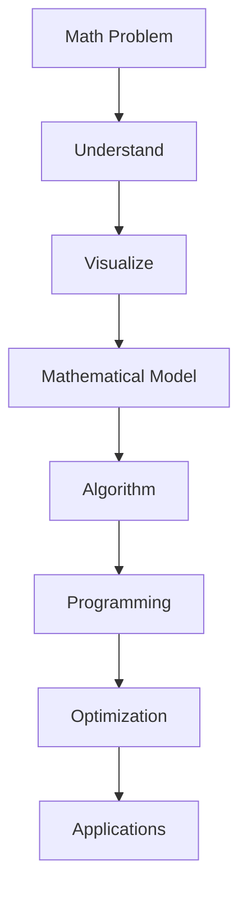
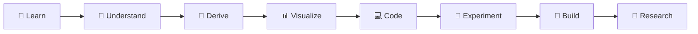
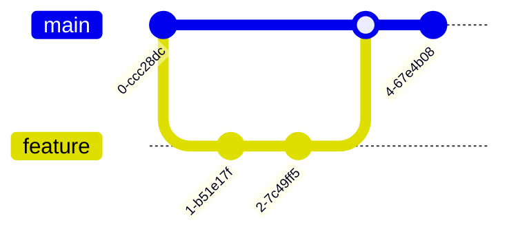

<!-- ========================================================= -->
<!--                     AIML-MATHEMATICAL TOOLKIT              -->
<!--                 README.md | PART 1 : HERO                 -->
<!-- ========================================================= -->

<p align="center">
  
</p>

<h1 align="center">
🧠 AIML-Mathematical Toolkit
</h1>

<h3 align="center">
From Equations → Algorithms → Intelligence
</h3>

<p align="center">
An Open-Source Mathematical Knowledge Base for <br>
Computer Science • Artificial Intelligence • Machine Learning • Physics • Scientific Computing
</p>

---

<p align="center">


</p>

---

# 🌟 Repository Status

<p align="center">


</p>

---

# 📊 Project Badges

<p align="center">


</p>

---

# 💻 Technology Stack

<p align="center">


</p>

---

# 🤖 AI Ecosystem

<p align="center">


</p>

---

# 📐 Mathematical Domains

<p align="center">


</p>

---

# ⚛️ Physics & Scientific Computing

<p align="center">


</p>

---

# 📑 Table of Contents

- [📌 About](#-about)
- [🎯 Vision](#-vision)
- [🚀 Why This Repository?](#-why-this-repository)
- [🎓 Who Is This For?](#-who-is-this-for)
- [✨ Features](#-features)
- [🧠 Learning Philosophy](#-learning-philosophy)

> 📖 **Part 2** will introduce:
>
> - Repository Architecture
> - Learning Roadmap
> - Mathematical Domains
> - AI Mathematics
> - Physics Mathematics
> - PIML
> - Mermaid Diagrams

---

# 📌 About

> **AIML-Mathematical Toolkit** is a comprehensive, open-source repository designed to bridge the gap between **mathematics**, **computer science**, **artificial intelligence**, **physics**, and **scientific computing**.

Unlike traditional note collections, this repository emphasizes **deep conceptual understanding** by connecting mathematical theory with computational implementation and real-world applications.

It is designed to help learners move from **memorizing formulas** to **thinking mathematically**, enabling them to understand the foundations behind algorithms, machine learning models, optimization techniques, and scientific simulations.

---

# 🎯 Vision

> **To build one of the most comprehensive open-source mathematical learning ecosystems for Computer Science, Artificial Intelligence, Machine Learning, Physics, and Research.**

Our vision is to transform mathematical learning into an interactive journey by combining:

- 📐 Mathematical intuition
- 📖 Formal definitions
- ✍️ Proofs & derivations
- ⚙️ Algorithms
- 💻 Programming implementations
- 📊 Simulations
- 📈 Visualizations
- 🤖 AI/ML applications
- ⚛️ Physics applications
- 🔬 Research perspectives

---

# 🚀 Why This Repository?

Many students can write code.

Fewer understand the mathematics that powers the code.

Many memorize equations.

Few understand why those equations work.

This repository focuses on building **first-principles understanding**, enabling learners to reason mathematically and apply concepts confidently across computer science, artificial intelligence, and scientific computing.

### Core Objectives

- 🧠 Develop Mathematical Thinking
- 🔗 Strengthen Logical Reasoning
- 📊 Improve Analytical Skills
- ⚙️ Understand Algorithms from First Principles
- 💻 Connect Mathematics with Programming
- 🤖 Master AI/ML Mathematics
- ⚛️ Explore Physics-Informed Machine Learning (PIML)
- 🔬 Encourage Research-Oriented Learning

---

# 🎓 Who Is This For?

| Learner | Benefits |
|----------|----------|
| 🎓 Computer Science Students | Strong mathematical foundations for algorithms and software engineering |
| 🤖 AI / ML Students | Deep understanding of the mathematics behind modern AI models |
| 📊 Data Scientists | Probability, statistics, optimization, and linear algebra |
| 💻 Competitive Programmers | Logic, combinatorics, graph theory, and mathematical algorithms |
| ⚛️ Physics Enthusiasts | Mathematical physics and computational modeling |
| 🔬 Researchers | Scientific Machine Learning, PINNs, optimization, and numerical methods |
| 📚 Self Learners | Structured learning from fundamentals to advanced topics |

---

# ✨ Features

## 📚 Comprehensive Learning

- Mathematical Foundations
- Discrete Mathematics
- Linear Algebra
- Calculus
- Probability
- Statistics
- Optimization
- Numerical Methods

---

## 🤖 Artificial Intelligence

- Machine Learning Mathematics
- Deep Learning Mathematics
- Transformers
- Reinforcement Learning
- Graph Neural Networks
- Generative AI Mathematics

---

## ⚛️ Scientific Computing

- Differential Equations
- PDE Solvers
- Computational Physics
- PINNs
- Scientific Machine Learning
- Numerical Optimization

---

## 💻 Programming

- Python
- C
- C++
- MATLAB
- Julia

---

## 📈 Visual Learning

- SVG Diagrams
- Flowcharts
- Infographics
- Cheat Sheets
- Handwritten Notes
- Interactive Simulations

---

## 🧪 Research

- Famous Equations
- Mathematical Proofs
- Algorithms
- Theorems
- Research Papers
- Case Studies

---

# 🧠 Learning Philosophy

```text
Understand
      │
      ▼
Visualize
      │
      ▼
Derive
      │
      ▼
Implement
      │
      ▼
Experiment
      │
      ▼
Optimize
      │
      ▼
Research
      │
      ▼
Innovate
```

---

<p align="center">

### ⭐ If you find this repository useful, consider giving it a Star!

**Mathematics → Algorithms → Intelligence → Innovation**

</p>

<!-- ======================= END OF PART 1 ======================= -->

<!-- ========================================================= -->
<!--            README.md | PART 2 : ROADMAP & DOMAINS         -->
<!-- ========================================================= -->

# 🗺️ Learning Roadmap

<p align="center">


</p>

---

# 🏗️ Repository Architecture

```text
                      AIML-MATHEMATICAL TOOLKIT

                                     │
 ┌───────────────────────────────────┼───────────────────────────────────┐
 │                                   │                                   │
 ▼                                   ▼                                   ▼

📚 Mathematics                 💻 Programming                    🤖 AI & ML

 │                                   │                                   │

 ├── Foundations                     ├── Python                         ├── ML Math
 ├── Discrete Math                   ├── C                              ├── DL Math
 ├── Linear Algebra                  ├── C++                            ├── Transformers
 ├── Calculus                        ├── MATLAB                         ├── RL
 ├── Probability                     ├── Julia                          ├── GNN
 ├── Statistics                      └── Projects                       └── LLM Math
 └── Optimization

                                     │

                                     ▼

                         ⚛️ Physics + Scientific Computing

                                     │

                      ├── Mechanics

                      ├── Thermodynamics

                      ├── Electromagnetism

                      ├── Quantum Physics

                      ├── Numerical Methods

                      ├── Differential Equations

                      └── Physics-Informed ML

```

---

# 📖 Repository Structure

```text
AIML-Mathematical-Toolkit
│
├── 📚 Mathematics
│   ├── Mathematical Foundations
│   ├── Discrete Mathematics
│   ├── Linear Algebra
│   ├── Calculus
│   ├── Probability
│   ├── Statistics
│   ├── Numerical Methods
│   └── Optimization
│
├── 🤖 Artificial Intelligence
│   ├── Machine Learning
│   ├── Deep Learning
│   ├── Reinforcement Learning
│   ├── Transformers
│   ├── Generative AI
│   └── Graph Neural Networks
│
├── ⚛️ Physics
│   ├── Classical Mechanics
│   ├── Waves
│   ├── Optics
│   ├── Thermodynamics
│   ├── Electromagnetism
│   ├── Modern Physics
│   └── Quantum Mechanics
│
├── 🔬 Scientific Computing
│   ├── Numerical Analysis
│   ├── Scientific ML
│   ├── PDE Solvers
│   ├── Finite Difference
│   ├── Finite Element
│   └── PINNs
│
├── 💻 Programming
│
├── 📊 Simulations
│
├── 📈 Visualizations
│
├── 📄 Notes
│
├── 📚 Resources
│
├── 📜 Theorems
│
├── 🧮 Equations
│
├── ⚙️ Algorithms
│
├── 🧩 Problems
│
└── 🚀 Projects

```

---

# 📚 Knowledge Domains

<table>

<tr>

<td align="center" width="25%">

### 📐 Mathematics

</td>

<td align="center" width="25%">

### 💻 Computing

</td>

<td align="center" width="25%">

### 🤖 AI / ML

</td>

<td align="center" width="25%">

### ⚛️ Physics

</td>

</tr>

<tr>

<td>

✔ Foundations

✔ Algebra

✔ Calculus

✔ Probability

✔ Statistics

✔ Optimization

</td>

<td>

✔ Algorithms

✔ Data Structures

✔ Complexity

✔ Logic

✔ Automata

✔ Numerical Computing

</td>

<td>

✔ Machine Learning

✔ Deep Learning

✔ Neural Networks

✔ Transformers

✔ LLM Mathematics

✔ Computer Vision

</td>

<td>

✔ Mechanics

✔ Thermodynamics

✔ Electromagnetism

✔ Quantum Physics

✔ Waves

✔ Scientific Computing

</td>

</tr>

</table>

---

# 🎯 Learning Philosophy

```text

Learn Concepts

      │

      ▼

Build Intuition

      │

      ▼

Understand Mathematics

      │

      ▼

Visualize

      │

      ▼

Implement in Code

      │

      ▼

Experiment

      │

      ▼

Optimize

      │

      ▼

Research

```

---

# 🎓 Learning Levels

| Level | Description |
|--------|-------------|
| 🟢 Beginner | Build intuition and mathematical reasoning |
| 🔵 Intermediate | Connect mathematics with programming |
| 🟣 Advanced | Mathematical derivations, proofs, and optimization |
| 🔴 Expert | AI, Scientific Computing, Research Mathematics |
| ⚫ Research | Papers, PINNs, Scientific ML, Advanced Topics |

---

# 🧮 Mathematical Foundations

The repository covers mathematics from first principles rather than isolated formulas.

## Topics

- Mathematical Logic
- Set Theory
- Relations
- Functions
- Proof Techniques
- Number Systems
- Sequences
- Series
- Mathematical Induction
- Combinatorics
- Boolean Algebra

---

# 📐 Core Mathematics

## Linear Algebra

- Vectors
- Matrices
- Matrix Operations
- Determinants
- Rank
- Eigenvalues
- Eigenvectors
- Vector Spaces
- Orthogonality
- SVD

---

## Calculus

- Limits
- Continuity
- Differentiation
- Integration
- Multivariable Calculus
- Gradient
- Jacobian
- Hessian
- Taylor Expansion

---

## Probability & Statistics

- Random Variables
- Bayes' Theorem
- Gaussian Distribution
- Bernoulli Distribution
- Poisson Distribution
- Expectation
- Variance
- Covariance
- Correlation
- Regression

---

## Optimization

- Linear Programming
- Convex Optimization
- Gradient Descent
- SGD
- Adam Optimizer
- Newton Method
- Lagrange Multipliers
- KKT Conditions

---

# 🤖 Artificial Intelligence Mathematics

```text
Mathematics
      │
      ▼
Machine Learning
      │
      ▼
Deep Learning
      │
      ▼
Transformers
      │
      ▼
Large Language Models
```

Topics include

- Neural Networks

- Matrix Calculus

- Backpropagation

- PCA

- SVM

- Logistic Regression

- Information Theory

- Attention Mechanism

- Positional Encoding

- Embeddings

- Loss Functions

- Optimization

---

# ⚛️ Physics Mathematics

> Mathematics is the language of nature.

Topics

- Kinematics

- Dynamics

- Rotational Motion

- Oscillations

- Waves

- Electricity

- Magnetism

- Thermodynamics

- Fluid Mechanics

- Optics

- Relativity

- Quantum Mechanics

- Statistical Mechanics

- Computational Physics

---

# 🔬 Physics-Informed Machine Learning (PIML)

One of the major goals of this repository is to bridge

> **Physics × Mathematics × Artificial Intelligence**

Topics

- Physics-Informed Neural Networks (PINNs)

- Scientific Machine Learning

- PDE Solvers

- Neural Operators

- Computational Fluid Dynamics

- Finite Difference Methods

- Finite Element Methods

- Surrogate Modeling

- Physics-guided Deep Learning

- Scientific Foundation Models

---

# 🧩 Problem Solving Ecosystem



---

# 💻 Programming Languages

<p align="center">


</p>

Used for

- Mathematical Algorithms

- AI

- Simulations

- Numerical Computing

- Scientific Programming

---

# 📊 Visualization Stack

- SVG Graphics

- Mermaid Diagrams

- GeoGebra

- Desmos

- Matplotlib

- Plotly

- Manim

- Jupyter Notebook

- MATLAB Visualization

---

# 📚 Learning Resources

Every topic includes

✅ Theory

✅ Mathematical Intuition

✅ Derivation

✅ Proof

✅ Visual Explanation

✅ Code

✅ Simulations

✅ Practice Problems

✅ Interview Questions

✅ Research References

---

<p align="center">

## 🚀 "Mathematics is not about numbers, equations, computations, or algorithms.

It is about understanding."

</p>

<!-- ================= END OF PART 2 ================= -->

<!-- ========================================================= -->
<!--        README.md | PART 3 : KNOWLEDGE LIBRARIES           -->
<!-- ========================================================= -->

# 📖 Mathematical Knowledge Library

> A comprehensive collection of mathematical concepts that power modern Computer Science, Artificial Intelligence, Machine Learning, Physics, Data Science, Robotics, and Scientific Computing.

---

# 🧮 Equations Library

> **Understand every equation beyond the formula.**

Every equation includes:

- 💡 Intuition
- 📜 Historical Background
- 🧠 Mathematical Derivation
- 📊 Graphical Visualization
- ⚙️ Computational Complexity
- 💻 Code Implementation
- 🤖 AI/ML Applications
- ⚛️ Physics Applications
- 📚 References

---

## 📐 Fundamental Mathematics

| Equation | Applications |
|----------|--------------|
| Euler's Formula | Complex Numbers |
| Euler's Identity | Mathematical Beauty |
| Pythagorean Theorem | Geometry |
| Binomial Expansion | Algebra |
| Quadratic Formula | Polynomial Solutions |
| Distance Formula | Coordinate Geometry |
| Midpoint Formula | Geometry |
| Heron's Formula | Triangles |
| Area & Volume Formulae | Geometry |
| Trigonometric Identities | Engineering Mathematics |

---

## ∫ Calculus

| Equation | Used In |
|------------|----------------|
| Limit Definition | Calculus |
| Derivative Formula | Optimization |
| Chain Rule | Deep Learning |
| Product Rule | Differentiation |
| Quotient Rule | Analysis |
| Taylor Series | Numerical Analysis |
| Maclaurin Series | Scientific Computing |
| Fundamental Theorem of Calculus | Integration |
| Gradient | Machine Learning |
| Jacobian Matrix | Neural Networks |
| Hessian Matrix | Optimization |

---

## 📊 Probability & Statistics

| Equation | Used In |
|------------|----------------|
| Bayes' Theorem | AI |
| Conditional Probability | ML |
| Gaussian Distribution | Statistics |
| Binomial Distribution | Data Science |
| Poisson Distribution | Modeling |
| Expectation | Probability |
| Variance | Statistics |
| Standard Deviation | Analytics |
| Covariance | ML |
| Correlation | Data Analysis |

---

## 🤖 AI / Machine Learning

| Equation | Used In |
|------------|----------------|
| Linear Regression | ML |
| Logistic Regression | ML |
| Sigmoid Function | Neural Networks |
| Softmax Function | Deep Learning |
| Cross Entropy Loss | Classification |
| Mean Squared Error | Regression |
| Gradient Descent | Optimization |
| Adam Optimizer | Deep Learning |
| Attention Equation | Transformers |
| Bellman Equation | Reinforcement Learning |

---

## ⚛️ Physics

| Equation | Used In |
|------------|----------------|
| Newton's Laws | Mechanics |
| Schrödinger Equation | Quantum Computing |
| Maxwell's Equations | Electromagnetism |
| Einstein Field Equation | Relativity |
| Navier–Stokes Equation | Fluid Mechanics |
| Heat Equation | Simulation |
| Wave Equation | Signal Processing |
| Continuity Equation | CFD |
| Bernoulli Equation | Fluid Dynamics |

---

# 📜 Theorem Library

Every theorem includes:

- 📖 Statement
- 🧠 Intuition
- ✍️ Mathematical Proof
- 📊 Visualization
- 💻 Implementation
- 🤖 AI Applications
- ⚛️ Physics Applications

---

## 📚 Algebra

- Fundamental Theorem of Algebra
- Rank-Nullity Theorem
- Cayley-Hamilton Theorem
- Spectral Theorem
- Singular Value Decomposition Theorem

---

## 📈 Calculus

- Rolle's Theorem
- Mean Value Theorem
- Intermediate Value Theorem
- Green's Theorem
- Stokes' Theorem
- Divergence Theorem

---

## 🎲 Probability

- Bayes' Theorem
- Central Limit Theorem
- Law of Large Numbers
- Chebyshev's Inequality
- Markov Inequality

---

## 🤖 AI / ML

- Universal Approximation Theorem
- No Free Lunch Theorem
- Representer Theorem
- Bias-Variance Theorem

---

# ⚙️ Algorithm Library

## Mathematical Algorithms

- Euclidean Algorithm
- Extended Euclidean Algorithm
- Fast Exponentiation
- Sieve of Eratosthenes
- Chinese Remainder Theorem
- Miller-Rabin Test
- Newton-Raphson Method
- Gaussian Elimination
- LU Decomposition
- QR Decomposition

---

## AI Algorithms

- Gradient Descent
- Stochastic Gradient Descent
- Adam
- RMSProp
- K-Means
- PCA
- SVM
- Decision Trees
- Random Forest
- XGBoost

---

## Scientific Algorithms

- FFT
- Dijkstra
- Bellman-Ford
- A*
- Dynamic Programming
- Monte Carlo Simulation
- Genetic Algorithm
- Simulated Annealing

---

# 💻 Programming Implementations

Each mathematical concept includes implementations in

<p align="center">


</p>

Programming examples include

- Basic Implementation
- Optimized Version
- Interview Solution
- Competitive Programming
- AI Implementation
- Scientific Computing Version

---

# 🧪 Simulations

Visual learning through simulations.

Supported tools

- GeoGebra
- Desmos
- Manim
- Python
- MATLAB
- Plotly
- Three.js
- Jupyter Notebook

Examples

- Gradient Descent Animation
- Neural Network Visualization
- Matrix Transformation
- Fourier Transform
- PCA Visualization
- Graph Traversal
- Probability Simulation
- Monte Carlo
- Fluid Simulation

---

# 🌍 Real World Applications

<table>

<tr>

<th>Field</th>

<th>Applications</th>

</tr>

<tr>

<td>🤖 Artificial Intelligence</td>

<td>Deep Learning, LLMs, Reinforcement Learning</td>

</tr>

<tr>

<td>🚗 Robotics</td>

<td>Localization, Motion Planning</td>

</tr>

<tr>

<td>🛰 Space Science</td>

<td>Orbital Mechanics, Navigation</td>

</tr>

<tr>

<td>🏥 Healthcare</td>

<td>Medical Imaging, Diagnosis</td>

</tr>

<tr>

<td>💹 Finance</td>

<td>Risk Analysis, Forecasting</td>

</tr>

<tr>

<td>🌦 Climate Science</td>

<td>Weather Prediction</td>

</tr>

<tr>

<td>⚡ Engineering</td>

<td>Control Systems</td>

</tr>

<tr>

<td>🧬 Bioinformatics</td>

<td>Genomics</td>

</tr>

</table>

---

# 👨‍🔬 Hall of Fame

## Mathematicians

- Leonhard Euler
- Carl Friedrich Gauss
- Bernhard Riemann
- Emmy Noether
- Srinivasa Ramanujan
- David Hilbert
- Alan Turing
- John von Neumann
- Claude Shannon

---

## Physicists

- Isaac Newton
- Albert Einstein
- James Clerk Maxwell
- Richard Feynman
- Niels Bohr
- Erwin Schrödinger
- Werner Heisenberg
- Paul Dirac
- Stephen Hawking

---

## Computer Scientists

- Donald Knuth
- Edsger Dijkstra
- Leslie Lamport
- Geoffrey Hinton
- Yann LeCun
- Yoshua Bengio
- Andrew Ng
- Demis Hassabis
- Fei-Fei Li

---

# 📚 Curated Resources

## Books

- Mathematics for Machine Learning
- Linear Algebra Done Right
- Introduction to Algorithms
- Pattern Recognition and Machine Learning
- Deep Learning
- Numerical Recipes
- Concrete Mathematics
- Artificial Intelligence: A Modern Approach

---

## Research Papers

- Attention Is All You Need
- AlexNet
- ResNet
- BERT
- GPT
- AlphaGo
- PINNs
- Neural Operators
- Vision Transformer

---

# 🏆 Mini Projects

- 📈 Gradient Descent Visualizer
- 🎲 Probability Simulator
- 📐 Matrix Calculator
- 🧮 Numerical Solver
- 🤖 Neural Network From Scratch
- 🛰 Orbital Motion Simulator
- 🌊 Fluid Dynamics Simulator
- 📊 PCA Visualizer
- 🧠 Transformer Attention Visualizer

---

# 🎯 Repository Goals

```text
Mathematics
      │
      ▼
Critical Thinking
      │
      ▼
Logical Reasoning
      │
      ▼
Problem Solving
      │
      ▼
Programming
      │
      ▼
Algorithms
      │
      ▼
Artificial Intelligence
      │
      ▼
Scientific Computing
      │
      ▼
Research
      │
      ▼
Innovation
```

---

# 📈 Repository Growth

| Stage | Status |
|:------|:------:|
| 📚 Mathematical Foundations | 🟡 Planned |
| 📜 Equations Library | 🟡 Planned |
| 📖 Theorem Library | 🟡 Planned |
| ⚙️ Algorithms | 🟡 Planned |
| 💻 Programming Examples | 🟡 Planned |
| 📊 Simulations | 🟡 Planned |
| 🤖 AI Mathematics | 🟡 Planned |
| ⚛️ Physics Mathematics | 🟡 Planned |
| 🔬 PIML / SciML | 🟡 Planned |
| 🚀 Mini Projects | 🟡 Planned |
| 📄 Research Papers | 🟡 Planned |
| 🌐 Documentation Website | 🔵 Future |

---

<p align="center">

## ⭐ "The goal is not to memorize mathematics, but to think mathematically."

### **Mathematics → Algorithms → Intelligence → Discovery**

</p>

<!-- ================= END OF PART 3 ================= -->

<!-- ========================================================= -->
<!--         README.md | PART 4 : OPEN SOURCE ECOSYSTEM        -->
<!-- ========================================================= -->

# 🚀 Quick Start

## Clone the Repository

```bash
git clone https://github.com/<your-username>/AIML-Mathematical-Toolkit.git

cd AIML-Mathematical-Toolkit
```

---

## Repository Structure

```bash
AIML-Mathematical-Toolkit
│
├── 📚 Mathematics
├── 🤖 AI-ML
├── ⚛️ Physics
├── 🔬 Scientific Computing
├── 💻 Implementations
├── 📊 Simulations
├── 📜 Equations
├── 📖 Theorems
├── ⚙️ Algorithms
├── 🧩 Problems
├── 📚 Resources
└── 🚀 Projects
```

---

# ⭐ Repository Highlights

<table>

<tr>

<td align="center">

## 📚

### 1000+

Mathematical Concepts

</td>

<td align="center">

## 📖

### 500+

Theorems

</td>

<td align="center">

## 📐

### 1500+

Equations

</td>

<td align="center">

## ⚙️

### 700+

Algorithms

</td>

</tr>

<tr>

<td align="center">

## 💻

### 500+

Programming Examples

</td>

<td align="center">

## 🤖

### AI

Mathematics

</td>

<td align="center">

## ⚛️

### Physics

Mathematics

</td>

<td align="center">

## 🔬

### Research

Ready

</td>

</tr>

</table>

---

# 🎯 Repository Goals

```mermaid

mindmap

root((AIML Mathematical Toolkit))

Mathematics

Computer Science

Algorithms

AI

Machine Learning

Deep Learning

Physics

Scientific Computing

PIML

Research

Open Source

```

---

# 📊 Repository Progress

| Module | Progress |
|---------|:-------:|
| 📚 Mathematical Foundations | 🟢 |
| 📖 Equations Library | 🟡 |
| 📜 Theorems Library | 🟡 |
| ⚙️ Algorithms | 🟡 |
| 💻 Programming Examples | 🟡 |
| 🤖 AI Mathematics | 🟡 |
| ⚛️ Physics Mathematics | 🟡 |
| 🔬 Scientific ML | 🔵 |
| 🧠 PINNs | 🔵 |
| 📊 Simulations | 🔵 |
| 🎥 Animations | 🔵 |
| 🌐 Documentation Website | ⚪ |

Legend

🟢 Complete

🟡 In Progress

🔵 Planned

⚪ Future

---

# 🧠 Learning Workflow



---

# 📂 Documentation

The repository is accompanied by detailed documentation.

```text
docs/

│

├── learning-roadmap.md

├── contributing.md

├── coding-guidelines.md

├── mathematical-notation.md

├── roadmap.md

├── equations.md

├── algorithms.md

├── ai-mathematics.md

├── physics.md

├── piml.md

└── faq.md
```

---

# 📦 Repository Ecosystem

```text

README

↓

Theory

↓

Visualization

↓

Derivation

↓

Implementation

↓

Simulation

↓

Projects

↓

Research

↓

Innovation

```

---

# 📈 Learning Resources

Every topic contains

- 📖 Concept

- 🧠 Intuition

- 📐 Mathematical Derivation

- 📜 Proof

- 📊 Graph

- 🎨 SVG Diagram

- 🎥 Animation

- 💻 Code

- ⚙️ Algorithm

- 🤖 AI Applications

- ⚛️ Physics Applications

- 🧩 Practice Problems

- ❓ Interview Questions

- 📚 References

---

# 💻 Code Examples

Programming Languages

<p align="center">


</p>

Every topic includes

```text

✔ Python

✔ C

✔ C++

✔ MATLAB

✔ Julia

✔ Jupyter Notebook

```

---

# 🎨 Visualization Stack

<p align="center">


</p>

Visualization Technologies

- SVG

- Mermaid

- Manim

- Matplotlib

- Plotly

- GeoGebra

- Desmos

- Three.js

---

# 🛣️ Future Roadmap

## Phase 1

- Mathematical Foundations

- Equations

- Theorems

- Algorithms

---

## Phase 2

- AI Mathematics

- Physics Mathematics

- Programming Examples

- Problem Solving

---

## Phase 3

- Scientific Computing

- PINNs

- Simulations

- Interactive Visualizations

---

## Phase 4

- Documentation Website

- Mobile App

- AI Tutor

- Interactive Playground

- Community Learning

---

# 🤝 Contributing

We welcome contributions from

- Students

- Developers

- Researchers

- Educators

- Open Source Contributors

---

## Ways to Contribute

- 📚 Add new concepts

- 📐 Add equations

- 📜 Add theorems

- ⚙️ Add algorithms

- 💻 Improve implementations

- 🎨 Create SVG diagrams

- 📊 Build simulations

- 🧪 Create notebooks

- 📄 Improve documentation

---

# 📜 Contribution Workflow



---

# ❤️ Support the Project

If this repository helps you,

please consider

⭐ Star the repository

🍴 Fork it

📢 Share it

🤝 Contribute

🐛 Report Issues

💡 Suggest Features

---

# 🌍 Community

Join the community to

- Learn

- Build

- Research

- Collaborate

- Teach

---

# 📄 License

This project will be released under the

**MIT License**

---

# 🙏 Acknowledgements

Inspired by

- The Algorithms

- TensorFlow

- PyTorch

- Hugging Face

- OpenMMLab

- Papers With Code

- MIT OpenCourseWare

- Stanford CS

- fast.ai

- DeepMind

---

# 📬 Connect

<p align="center">

<a href="https://github.com/<username>">


</a>

<a href="https://linkedin.com/in/<username>">


</a>

<a href="mailto:your@email.com">


</a>

</p>

---

<p align="center">

# ⭐ AIML-Mathematical Toolkit

### From Equations → Algorithms → Intelligence


---

### 📐 Mathematics • 💻 Programming • 🤖 AI • ⚛️ Physics • 🔬 Research

**"The beautiful thing about learning is that no one can take it away from you."**

Made with ❤️ for the Open Source Community.

</p>

<!-- ========================================================= -->
<!--                    END OF README                          -->
<!-- ========================================================= -->
